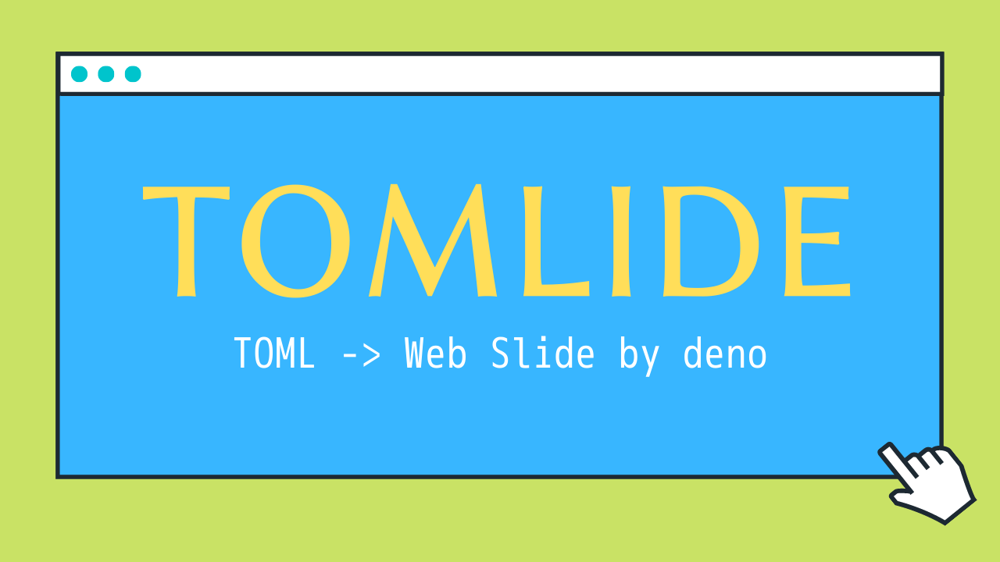

# tomlide

Generate simple web slide from toml file



## feature

- generate simple web slide from toml file like [this](./example/slide.toml)
- inside toml file, some original markup available.

```none
# link
@[link](https://github.com/uta8a/tomlide) -> Link to URL
@[link: Project repository](https://github.com/uta8a/tomlide) -> Link to URL with innerText
@[link: slide 1](@1) -> Link to Slide Page @1

# Image
@[image](./tomlide.v1.png) -> image to [png|jpg|ico|svg|PNG|JPG|ICO|SVG]
@[image](https://avatars.githubusercontent.com/u/31395466?v=4) -> image from web
@[image: alt and description](https://avatars.githubusercontent.com/u/31395466?v=4) -> image with description below
@[link: @[image: image inside link](https://github.com/uta8a/tomlide)](./tomlide.v1.png) -> image inside link

# emoji
@[:tada:] -> 🎉
alias by "GitHub" and "CLDR Short Name" are available

# bold
@[*bold text*] -> BOLD TEXT (font-weight: bold;)
```

## development

```shell
# setup git-hook
vr
# watch
vr watch
# compile to dist
vr main
# dev server at localhost:8000
vr server

# more, see ./velociraptor.yml
```

## license

- include
  [Twemoji 13.1.0](https://github.com/twitter/twemoji/releases/tag/v13.1.0) in
  `assets/`
  - [Twemoji v13.1.0](https://github.com/twitter/twemoji/tree/v13.1.0) graphics
    assets originally licensed under CC-BY 4.0:
    https://creativecommons.org/licenses/by/4.0/
  - CC-BY-4.0 allowes share(redistribution). if any license problems about this
    project, please contact me by open
    [tomlide/issue](https://github.com/uta8a/tomlide/issues).
